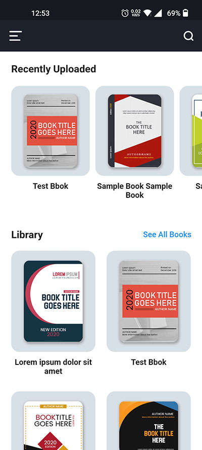
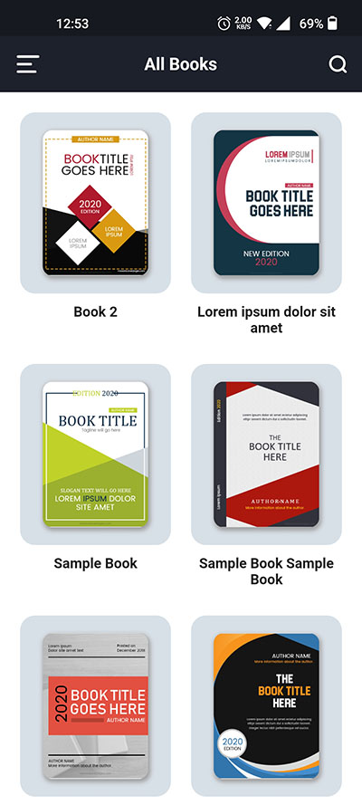
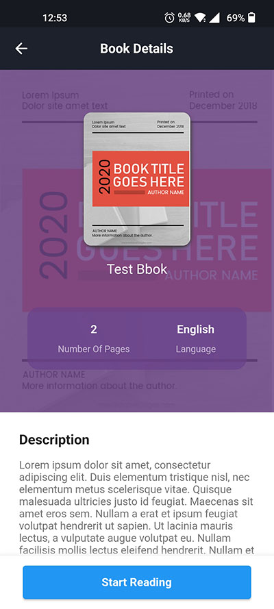
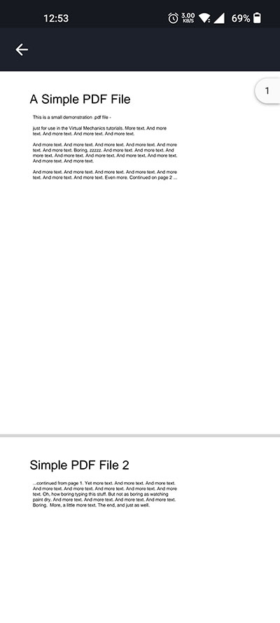

# Hasper EBook

Hasper EBook mobile app for Android & IOS devices built with Dart & Google's Flutter.

### Support this project

   
<!--  -->

## Screenshots

  &nbsp;  &nbsp;  &nbsp; 
 
  &nbsp;  &nbsp; 
